# REDES_1_PROYECTO_1_2022

# Grupo #12 | Proyecto 1

### Universidad de San Carlos de Guatemala
### Facultad de Ingeniería
### Escuela de Ciencias y Sistemas
### Redes de Computadoras 1

> Integrantes
> - 201115018 - Joel Rodríguez Santos
> - 201700644 - Javier Roberto Alfaro Vividor
> - 201709311 - Edin Emanuel Montenegro Vasquez
> - 201709110 - Wilson Eduardo Perez Echeverria

---
# MANUAL DE CONFIGURACIÓN
## CONTENIDO
* [Descripción de Problema](#descripción-de-problema)
  * [Red Física](#red-física)
  * [Red Virtualizada](#red-virtualizada)
* [Requerimientos del Sistema](#requerimientos-del-sistema)
    * [Instalacion Imagen de Switch](#instalacion-imagen-de-switch) 
* [TOPOLOGIAS](#topologias)
  * [Tabla 1](#tabla-1) 
  * [TOPOLOGIA 1: Área de Trabajo](#topologia-1-área-de-trabajo)
    * [Configuracion topologia 1](#configuracion-topologia-1)
  * [TOPOLOGIA 2: Backbone](#topologia-2-backbone)
    * [Configuracion topologia 2](#configuracion-topologia-2)
  * [TOPOLOGIA 3: Zona de Servidores](#topologia-3-zona-de-servidores)
    * [Configuracion topologia 3](#configuracion-topologia-3)
<!-- toc! -->

## Descripción de Problema
Configurar el cableado estructurado para una empresa que desea administrar sus computadoras de los diferentes departamentos.
La topologia de la red es proporcinada por la empresa, la cual se debera configurar para poder comunicar conforme a los requerimientos.
En la compañia se busca comunicar entre los diferentes usuarios del mismo departamento sin la opcion de poder comunicar con los otros departamentos.
La cmpañia cuenta con el de partamento de ventas , informatica, recursos humanos y contabilidad, las cuales se tienen que comunicar solo entre su mismo departamento.

## Red Física
Se tiene 4 computadoras de forma fisica conectaadas a la VPN la cual forman una red tieneido conexion y acceso a compartir archivos entre ellas.

## Red Virtualizada
Se configura una maquina por cada departamento la cual contiene un servidor web en cada departamento.

---
# Requerimientos del Sistema

## Simulador de red: 

Se instalo GNS3 el cual es un programa para simular sistemas de red , la version utilizada es la version 2.2.29

## Imágenes de dispositivos virtuales: 

Se configuro las todas las imagenes necesarioas para poder conectar los dispositivos, la imagen virtual que se adiciono es un dispositovo Switch de capa 3

## Sistema operativo: 

Sistema operativo windows 10

## Instalacion Imagen de Switch:

Para instalar la imagen se siguieron los siguientes pasos mostrados acontinuacion:

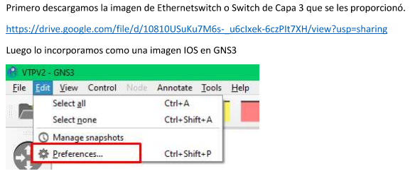
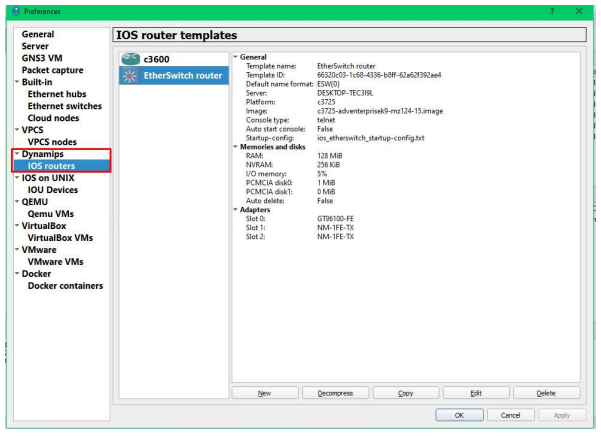
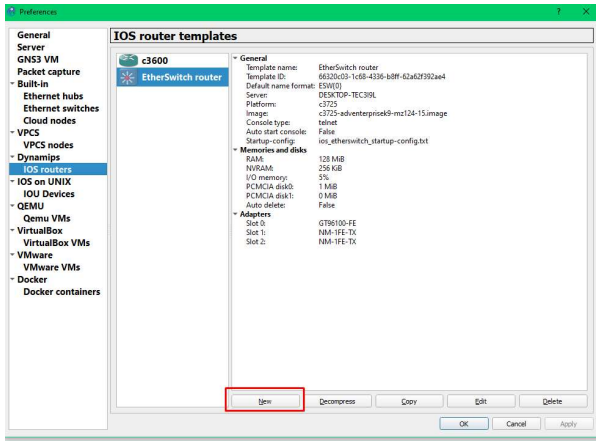
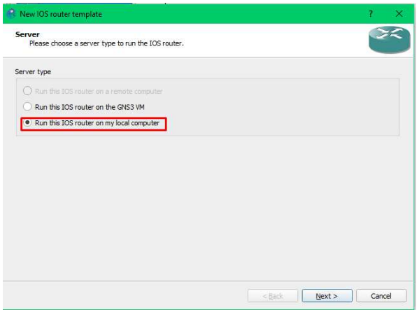
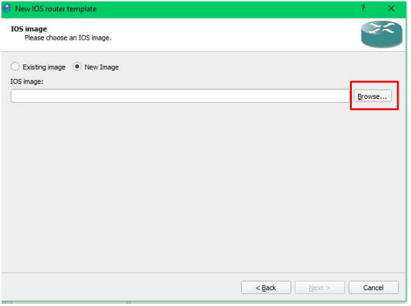
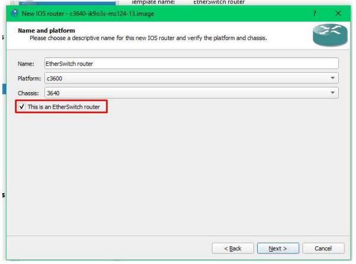

---
## TOPOLOGIAS

Las topologias se deben configurar siguiendo los siguientes parametros. 

Tabla de distribución de direcciones ip correspondientes a cada
departamento de la empresa. La X representa el número de grupo elegido.

### TABLA 1

| Nombre        | No.VLAN | Direccion de Red | Primera Direccion Asignable | Ultimo Direccion Asignable |Gateway |
|---------------|---------|------------------|-----------------------------|----------------------------|------------------------|
| RRHH          | 10      | 192.168.X1.0/24  | 192.168.X1                  | 192.168.X1.254             | 192.168.X1.1         |
| Informatica   | 20      | 192.168.X2.0/24  | 192.168.X2                  | 192.168.X2.254             | 192.168.X2.1         |
| Constabilidad | 30      | 192.168.X3.0/24  | 192.168.X3                  | 192.168.X3.254             | 192.168.X3.1         |
| Ventas        | 40      | 192.168.X4.0/24  | 192.168.X4                  | 192.168.X4.254             | 192.168.X4.1         |

Nota: /24 es una notación de máscara subred, un término que se explicará en la siguiente
fase. Tomar en cuenta que esto es equivalente a 255.255.255.0.

### TOPOLOGIA 1: Área de Trabajo
Esta zona, corresponde a la sección de cableado horizontal y área de trabajo, donde los usuarios
finales tendrán acceso a los puntos de red y conectar un dispositivo final. La topografía y
características correspondientes de la red es la siguiente: 

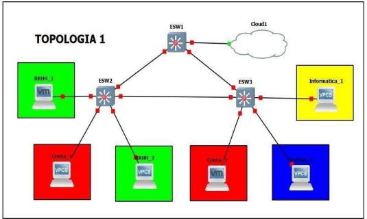

### Configuracion topologia 1

La máquina RRHH_1 es virtualizada en la que se consume el servicio del servidor rrhh. 

La máquina Conta_2 es virtualizada y consume el servicio del
servidor contabilidad. 

Se debe configurar los puertos de los switch en modo access o modo troncal, según corresponda. 
* Configurar VTP con los siguientes datos:
  * Dominio: Grupo# (# - será el número de grupo asignado)
  * Contraseña: Grupo# (#-será el número de grupo asignado)
  * Modos de configuración:
    * Cliente:
      * ESW1
      * ESW2
      * ESW3

A continuacion puede observarse las configuraciones necesarias en cada uno de los dispositivos y switchs para la toplogia 1:

---
### comandos utilizados en las vpcs

CONFIGURACION VPCS
 - RRHH

   ip 192.168.121.X0/24 192.168.121.1
   - RRHH_1

     ip 192.168.121.10/24 192.168.121.1

   - RRHH_2

     ip 192.168.121.20/24 192.168.121.1

 - INFORMATICA

   ip 192.168.122.X0/24 192.168.122.1
   - INFORMATICA_1

     ip 192.168.122.10/24 192.168.122.1
 - CONTABILIDAD

   ip 192.168.123.X0/24 192.168.123.1
   - CONTA_1

     ip 192.168.123.10/24 192.168.123.1
   - CONTA_2

     ip 192.168.123.20/24 192.168.123.1

 - VENTAS

   ip 192.168.124.X0/24 192.168.124.1
   - VENTAS_1

     ip 192.168.124.10/24 192.168.124.1

## VPCs Ping

Ping de maquina virtual de RRHH hacia la maquina dos de RRHH de la topologia 1

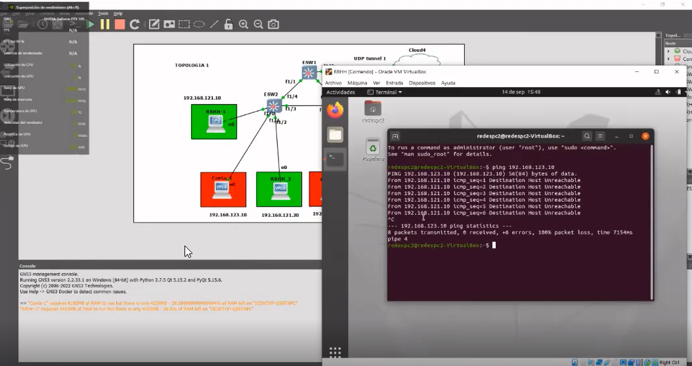

---
### comandos utilizados en los switches

CONFIGURACION ETHERSWITCH

 * MODE ACCESS ENTRE SWITCH A VPCS

	switchport mode access

	- VLAN RRHH

	  switchport access vlan 10
	- VLAN INFORMATICA

	  switchport access vlan 20
	- VLAN CONTABILIDAD

	  switchport access vlan 30
	- VLAN VENTAS

	  switchport access vlan 40

 * MODE TRUNK SWITCH A SWITCH

	switchport mode trunk

	switchport trunk allowed vlan 1,10,20,30,40,1002-1005
### switches

* CONFIGURACION VTP

 vtp domain GRUPO12
 vtp password grupo12
 vtp mode client

 * CONFIGURACION CLOUD

 LOCAL PORT: 4001
 REMOTE HOST: 10.8.0.2
 REMOTE PORT: 4002

--- 
### TOPOLOGIA 2: Backbone
La zona de cableado vertical será la encargada de conectar el área de trabajo con la zona
de servidores, para esto se tiene nodos altamente redundantes cuya finalidad es brindar
una conectividad el 100% del tiempo

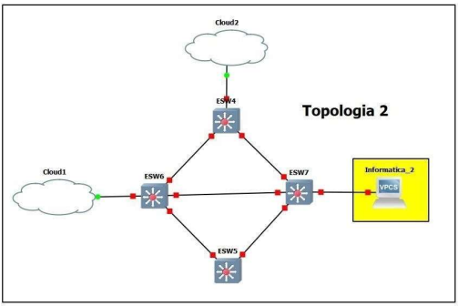

#### Configuracion topologia 2

* Debe agregarse las máquinas, tomando en cuenta que todas son vpc.
* Configurar los puertos de los switch en modo access o modo troncal (dot1Q), según corresponda.
* Crear las 4 VLAN únicamente en el ESW4 como lo muestra la [tabla 1.0]($tabla-1).
* Configurar VTP con los siguientes datos:
  * Dominio: Grupo# (# - será el número de grupo asignado).
  * Contraseña: Grupo# (#-será el número de grupo asignado).
  * Versión: Configurar la versión 2.
  * Modos de configuración:
    * Cliente:
      * ESW5
      * ESW6
      * ESW7
    * Server:
      * ESW4
* Configurar STP con los siguientes datos:
  * ESW4 será el root bridge para la vlan 1,10,20,30,40.
* Configurar la nube 1, con el puerto 4002 de salida y 4001 de entrada. Configurar la nube 2, con el puerto 4003 de salida y 4004 de entrada.

---
A continuacion puede observarse las configuraciones necesarias en cada uno de los dispositivos y switchs para la toplogia 2:

### Comandos vpcs

* Configurar VPCS

 - ip 192.168.122.20/24 192.168.122.1

### VPC

### comandos switches

* configurar Router

* configure terminal
 - vlan 20
* name informatica
--- 
- interface f1/0
- switchport mode access
- switchport access vlan 20

---

- interface f1/2
- switchport mode trunk
- switchport trunk allowed vlan 1,10,20,1002-1005

- interface f1/1
- switchport mode trunk
- switchport trunk allowed vlan 1,10,20,1002-1005

- interface f1/0
- switchport mode trunk
- switchport trunk allowed vlan 1,10,20,1002-1005

--- 
* Configurar vtp

vtp domain GRUPO12
vtp password grupo12
vtp mode server || client
vtp version 2
vtp pruning

### Switches

--- 
### TOPOLOGIA 3: Zona de Servidores
Lugar donde se almacenan los servidores web de la empresa. Se requiere que los mismos estén siempre activos, debido a esto la topología se vuelve extremadamente pesada. Por lo que se usará un nodo maestro-esclavo para equilibrar la carga del mismo.

### Configuracion topologia 3

* En este apartado, los servidores web son simples VPC’S, no se debe configurar nada en ellos más que su dirección ip. Se comprobará el acceso a ellos por medio de un PING.

* Configurar los puertos de los switch en modo access o modo troncal, según corresponda.

* Configurar VTP con los siguientes datos:
  * Dominio: Grupo# (# - será el número de grupo asignado).
  * Contraseña: Grupo# (#-será el número de grupo asignado).
  * Versión: Configurar la versión 2.
  * Modos de configuración:
    * Cliente:
      * ESW8
      * ESW9
      * ESW10
    * Transparent:
      * 1.  ESW11

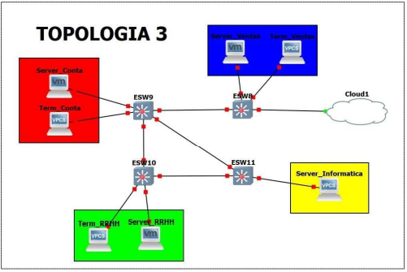

---
A continuacion puede observarse las configuraciones necesarias en cada uno de los dispositivos y switchs para la toplogia 3:

### Comandos utilisados VPCs

* IPS DE LAS VPC

- Server_RRHH

ip 192.168.121.10 255.255.255.0 192.168.121.1
- Server_Informatica

ip 192.168.122.80 255.255.255.0 192.168.122.1
- Server_Conta

ip 192.168.123.10 255.255.255.0 192.168.123.1
- Server_Ventas

ip 192.168.124.10 255.255.255.0 192.168.124.1

### Comandos utilizados en los switches

### ROUTER EWS1

* INTERFAZ F1/0

int f1/0
switchport mode access
switchport access vlan 20
* INTERFAZ F1/1

int f1/1
switchport mode trunk
switchport trunk allowed vlan 1,10,20,30,40,1002-1005

* INTERFAZ F1/2

int f1/2
switchport mode trunk
switchport trunk allowed vlan 1,10,20,30,40,1002-1005

* RELIZAR VTP

vtp domain GRUPO12
vtp pass grupo12
vtp version 2
vtp mode transparent

### ROUTER EWS2

* INTERFAZ F1/0

int f1/0
switchport mode access
switchport access vlan 10

* INTERFAZ F1/2

int f1/2
switchport mode trunk
switchport trunk allowed vlan 1,10,20,30,40,1002-1005

* INTERFAZ F1/3

int f1/3
switchport mode trunk
switchport trunk allowed vlan 1,10,20,30,40,1002-1005

* RELIZAR VTP

vtp domain GRUPO12
vtp pass grupo12
vtp version 2
vtp mode client

### ROUTER EWS3

* INTERFAZ F1/0

int f1/0
switchport mode access
switchport access vlan 30

* INTERFAZ F1/1

int f1/1
switchport mode trunk
switchport trunk allowed vlan 1,10,20,30,40,1002-1005

* INTERFAZ F1/3

int f1/3
switchport mode trunk
switchport trunk allowed vlan 1,10,20,30,40,1002-1005

* INTERFAZ F1/4

int f1/4
switchport mode trunk
switchport trunk allowed vlan 1,10,20,30,40,1002-1005

* RELIZAR VTP

vtp domain GRUPO12
vtp pass grupo12
vtp version 2
vtp mode client

### ROUTER EWS4

* INTERFAZ F1/0

int f1/0
switchport mode access
switchport access vlan 40

* INTERFAZ F1/4

int f1/4
switchport mode trunk
switchport trunk allowed vlan 1,10,20,30,40,1002-1005

* INTERFAZ F1/1

int f1/1
switchport mode trunk
switchport trunk allowed vlan 1,10,20,30,40,1002-1005

* RELIZAR VTP

vtp domain GRUPO12
vtp pass grupo12
vtp version 2
vtp mode client

### Switches

### nube

### VPC (ping)

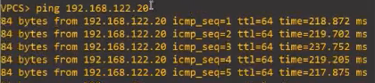
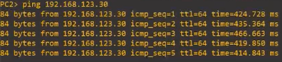

Acceso a la pagina de ventas desde la topologia 1 hacia la topologia 3

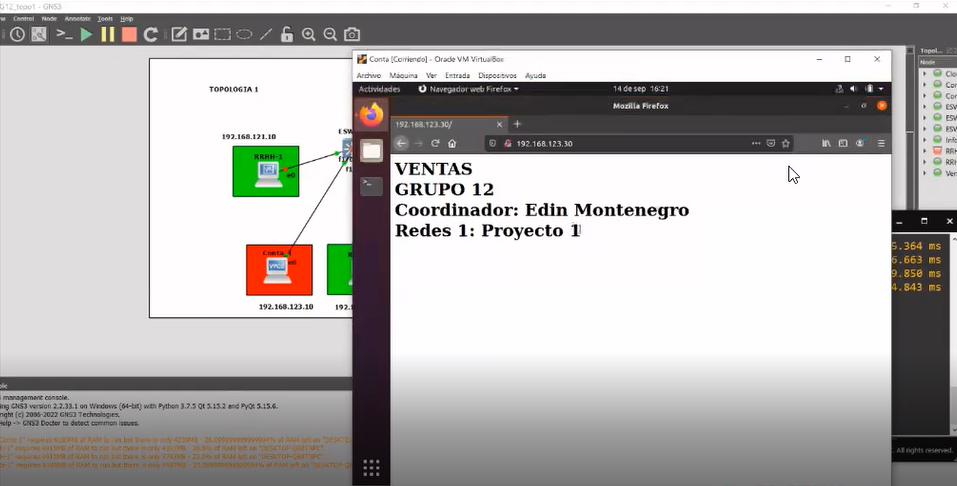
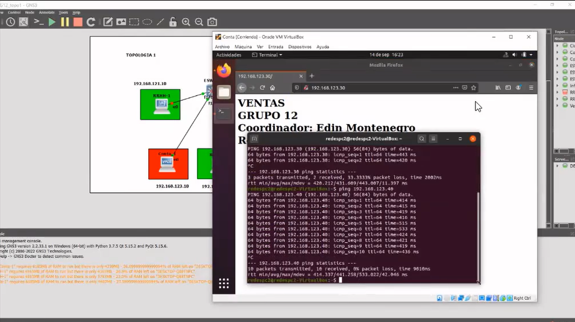

Ping desde la yopologia 1 hacia la topologia 2 y 3
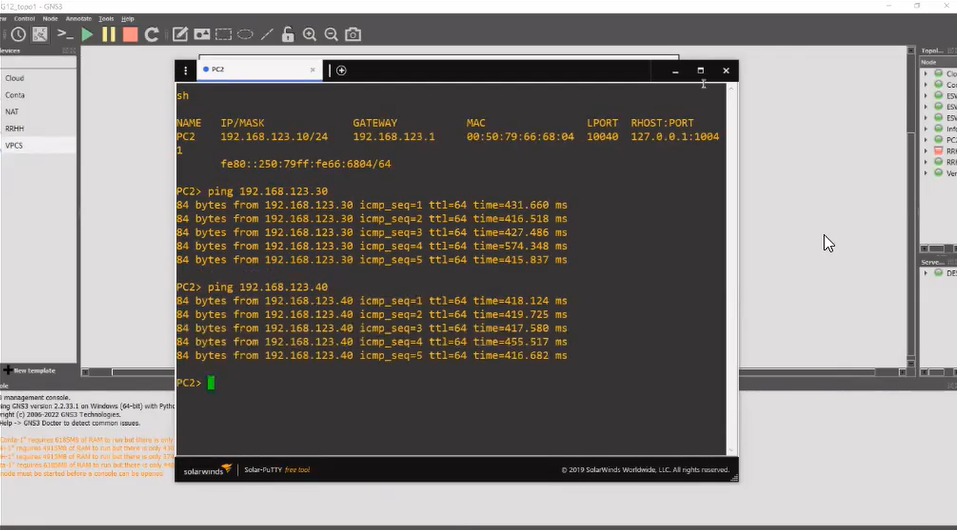

Acceso a la pagina de RRHH desde la topologia 1 hacia la topologia 3

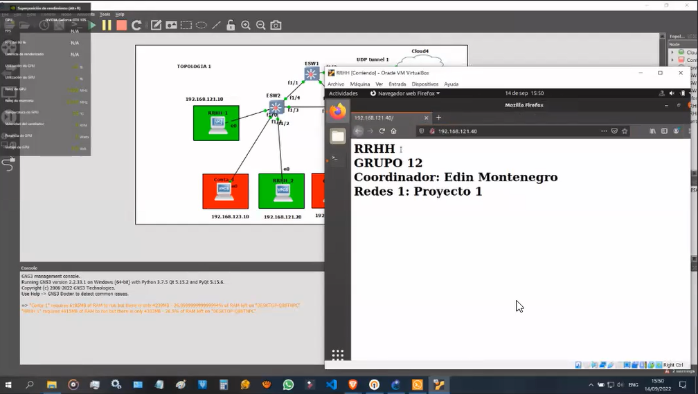